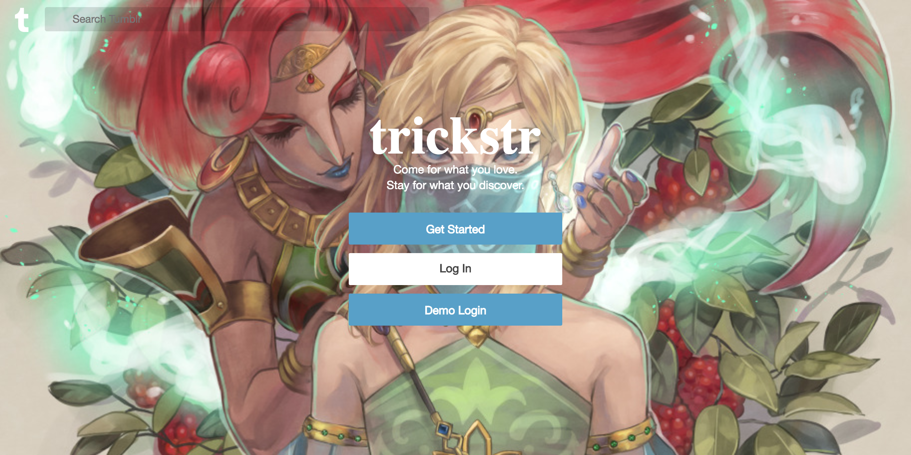
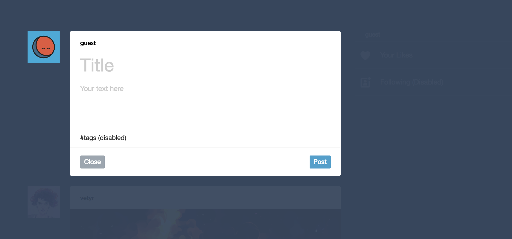
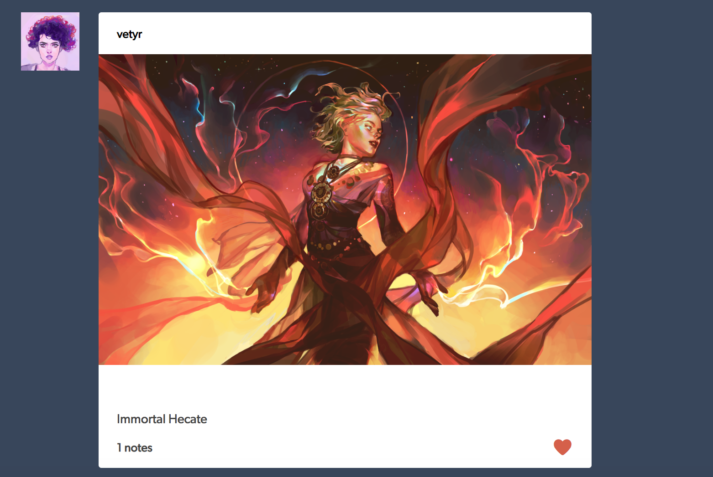

# Trickstr

[Live Site](https://trickstr.herokuapp.com/#/)

Trickstr is a full-stack web application based on Tumblr. It is built with Ruby on Rails backend, PostgreSQL database, and React + Redux frontend.

## Features and Implementation

**Users can create, edit, or delete their posts**

The current implementation allows users to create either a text or a photo post.
For text posts, users can submit title and description. If both are empty, they will not be able to submit.

Users can post multiple images for photo posts. They can drag and drop images. 

Once a post is submitted, it will be added to the current feed and displayed on top.
If user is the author of a post, they can edit or delete it by pressing the gear button on the right bottom of the post.

Post forms show a smooth transition and does not overlap any of the posts listed above or below.

**Users can view the feed**

When a user is logged in, they can view the feed of posts. Most recent posts appear on top.
These posts display author's avatar, username, title and description for text posts, caption for photo posts, notes (sum of likes, comments, and reblogs).

**Users can like a post and see liked posts**

A user can like a post if he/she is not the author. They will get direct feedback as the like icon turns red or grey depending on the user's action.
Like/Dislike directly reflects the number displayed on notes. If a post has zero notes, it will not be displayed. Users can click 'Your Likes' on the right side which will repopulate the feed with any posts the user has liked. If a user did not like any posts, there will be no changes. 

**Users can follow other users**

When a user hovers his cursor over another user's avatar, a popup will appear which allows the user to follow/unfollow the author. The popup button will update based on whether a user is following or unfollowing the post creator. When a user hover's his own avatar, it will display his/her own information.

## Future Implementations
- Follows/Followers view
- Infinite Scrolling
- Tags
- Reblogs
- Search
- Explore
- Comments
